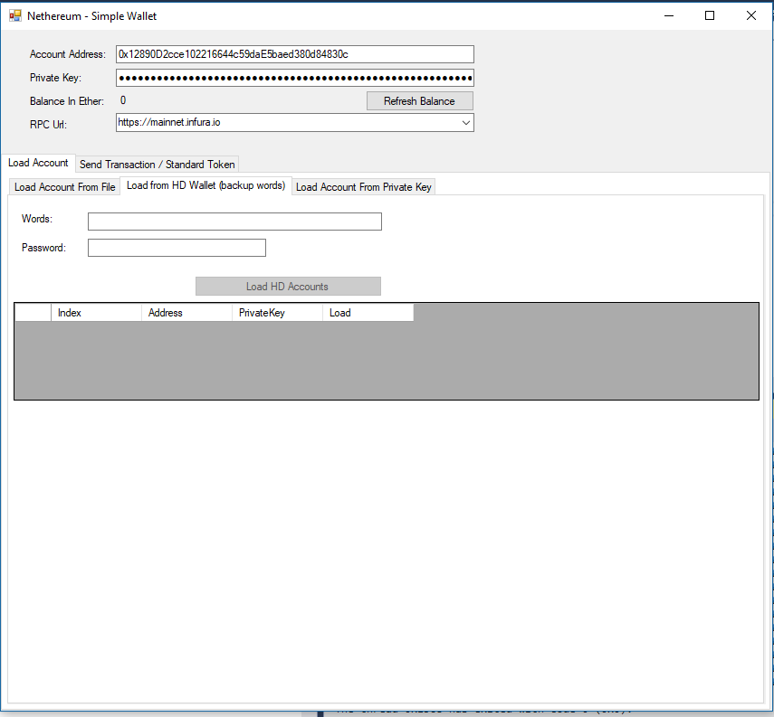
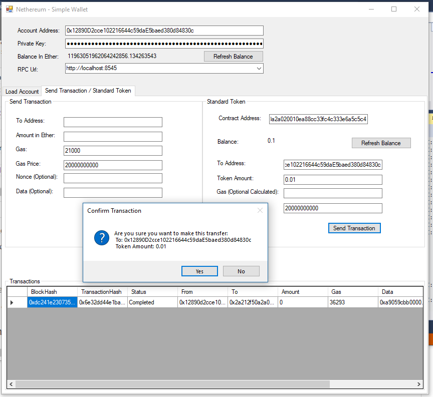

# Nethereum SimpleWindowsWallet

Functional sample / spike of a Reactive WindowsForms wallet connecting to Nethereum. 

The sample provides an overview of loading accounts from different sources (KeyStore, HdWallet backup words, Private Key) and overall interaction with Ethereum to send transactions and interact with a standard token contract.

## Why this sample?

The aim of the sample is to provide another learning exercise of Nethereum, but at the same time work as the MVVM spike towards the full Reactive UI solution, which will be also based on Xamarin.Forms as per the other sample, include hybrid dapps, multi signature, uport, etc, etc.

NOTE: The sample is not the a hardened solution so there is no error handling, there is not generic validation binded to view models, context handling (everything is done through messaging), decoupling of signing transactions, etc.
In this sample, a special INFURA API key is used: `7238211010344719ad14a89db874158c`. If you wish to use this sample in your own project you’ll need to [sign up on INFURA](https://infura.io/register) and use your own key.

## Screenshots

